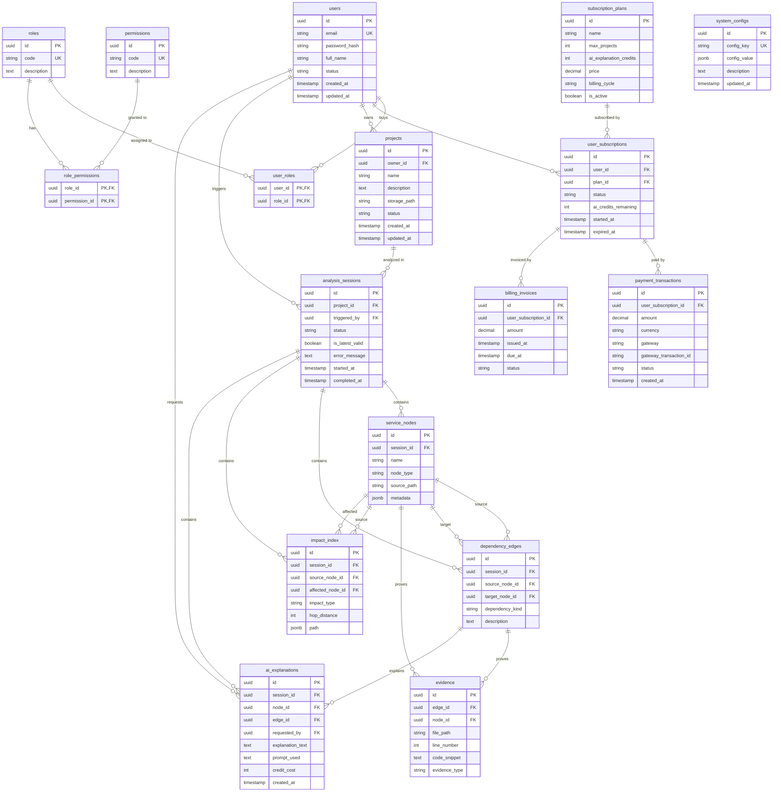

# MAVIS - ERD Preview (Mermaid)

Block code bên dưới render duoc trong GitHub, VS Code (extension Markdown Preview Mermaid), Notion.

```mermaid
erDiagram
    users ||--o{ user_roles : "has"
    users ||--o{ user_subscriptions : "buys"
    users ||--o{ projects : "owns"
    users ||--o{ analysis_sessions : "triggers"
    users ||--o{ ai_explanations : "requests"

    roles ||--o{ user_roles : "assigned to"
    roles ||--o{ role_permissions : "has"

    permissions ||--o{ role_permissions : "granted to"

    subscription_plans ||--o{ user_subscriptions : "subscribed by"

    user_subscriptions ||--o{ payment_transactions : "paid by"
    user_subscriptions ||--o{ billing_invoices : "invoiced by"

    projects ||--o{ analysis_sessions : "analyzed in"

    analysis_sessions ||--o{ service_nodes : "contains"
    analysis_sessions ||--o{ dependency_edges : "contains"
    analysis_sessions ||--o{ impact_index : "contains"
    analysis_sessions ||--o{ ai_explanations : "contains"

    service_nodes ||--o{ dependency_edges : "source"
    service_nodes ||--o{ dependency_edges : "target"
    service_nodes ||--o{ evidence : "proves"
    service_nodes ||--o{ impact_index : "source"
    service_nodes ||--o{ impact_index : "affected"

    dependency_edges ||--o{ evidence : "proves"
    dependency_edges ||--o{ ai_explanations : "explains"

    users {
        uuid id PK
        string email UK
        string password_hash
        string full_name
        string status
        timestamp created_at
        timestamp updated_at
    }

    roles {
        uuid id PK
        string code UK
        text description
    }

    permissions {
        uuid id PK
        string code UK
        text description
    }

    user_roles {
        uuid user_id PK,FK
        uuid role_id PK,FK
    }

    role_permissions {
        uuid role_id PK,FK
        uuid permission_id PK,FK
    }

    subscription_plans {
        uuid id PK
        string name
        int max_projects
        int ai_explanation_credits
        decimal price
        string billing_cycle
        boolean is_active
    }

    user_subscriptions {
        uuid id PK
        uuid user_id FK
        uuid plan_id FK
        string status
        int ai_credits_remaining
        timestamp started_at
        timestamp expired_at
    }

    payment_transactions {
        uuid id PK
        uuid user_subscription_id FK
        decimal amount
        string currency
        string gateway
        string gateway_transaction_id
        string status
        timestamp created_at
    }

    billing_invoices {
        uuid id PK
        uuid user_subscription_id FK
        decimal amount
        timestamp issued_at
        timestamp due_at
        string status
    }

    system_configs {
        uuid id PK
        string config_key UK
        jsonb config_value
        text description
        timestamp updated_at
    }

    projects {
        uuid id PK
        uuid owner_id FK
        string name
        text description
        string storage_path
        string status
        timestamp created_at
        timestamp updated_at
    }

    analysis_sessions {
        uuid id PK
        uuid project_id FK
        uuid triggered_by FK
        string status
        boolean is_latest_valid
        text error_message
        timestamp started_at
        timestamp completed_at
    }

    service_nodes {
        uuid id PK
        uuid session_id FK
        string name
        string node_type
        string source_path
        jsonb metadata
    }

    dependency_edges {
        uuid id PK
        uuid session_id FK
        uuid source_node_id FK
        uuid target_node_id FK
        string dependency_kind
        text description
    }

    evidence {
        uuid id PK
        uuid edge_id FK
        uuid node_id FK
        string file_path
        int line_number
        text code_snippet
        string evidence_type
    }

    impact_index {
        uuid id PK
        uuid session_id FK
        uuid source_node_id FK
        uuid affected_node_id FK
        string impact_type
        int hop_distance
        jsonb path
    }

    ai_explanations {
        uuid id PK
        uuid session_id FK
        uuid node_id FK
        uuid edge_id FK
        uuid requested_by FK
        text explanation_text
        text prompt_used
        int credit_cost
        timestamp created_at
    }
```
